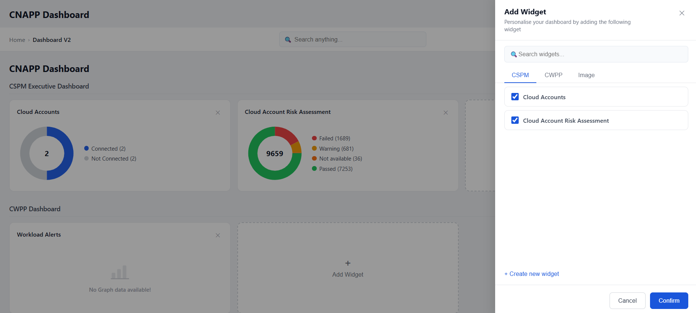

# CNAPP Dashboard

A dynamic dashboard application built with React, TypeScript, and Zustand — created as part of the Frontend Trainee Assignment.



## Live Demo

> Add your deployment link here (e.g. https://dashboard-assignment.vercel.app)

## Features

- **Dynamic widgets** — widgets are driven by a JSON data structure; no hardcoded JSX
- **Add widgets** — click "+ Add Widget" on any category row or the top header button to open the modal
- **Remove widgets** — click the ✕ icon on any widget card to remove it from its category
- **Category tabs in modal** — the Add Widget modal organises widgets by category (CSPM, CWPP, Image) with checkbox toggles
- **Search** — search across all widgets from both the dashboard header and inside the modal
- **Persistent state** — widget additions and removals survive page refresh via Zustand + localStorage

## Tech Stack

- React 18 + TypeScript
- Zustand (state management)
- Recharts (donut charts)
- Vite (build tool)

## Getting Started

### Prerequisites

- Node.js v18 or above
- npm v9 or above

### Installation & Running Locally

```bash
# 1. Clone the repository
git clone https://github.com/jHa1911/dashboard-assignment.git

# 2. Navigate into the project
cd dashboard-assignment

# 3. Install dependencies
npm install

# 4. Start the development server
npm run dev
```

The app will be running at `http://localhost:5173`

### Build for Production

```bash
npm run build
```

## Project Structure

```
src/
├── components/
│   ├── Dashboard.tsx          # Main layout, top bar, search
│   ├── CategorySection.tsx    # Renders each category + its widgets grid
│   ├── WidgetCard.tsx         # Individual widget card with remove button
│   ├── AddWidgetModal.tsx     # Slide-in modal with tabs, search, checkboxes
│   ├── DonutWidget.tsx        # Pie/donut chart widget (Recharts)
│   ├── ProgressWidget.tsx     # Multi-segment progress bar widget
│   └── EmptyWidget.tsx        # Empty state widget (no data available)
├── data/
│   └── dashboardData.ts       # JSON source of all categories and widgets
├── store/
│   └── dashboardStore.ts      # Zustand store — addWidget / removeWidget
├── styles/
│   └── dashboard.css          # All component styles
└── types/
    └── dashboard.ts           # TypeScript interfaces for Widget and Category
```

## How the JSON Structure Works

Categories and widgets are defined in `src/data/dashboardData.ts`. Each category contains an array of widgets:

```json
{
  "id": "cspm",
  "title": "CSPM Executive Dashboard",
  "widgets": [
    {
      "id": "w1",
      "title": "Cloud Accounts",
      "type": "donut",
      "description": "2 Total",
      "data": { ... }
    }
  ]
}
```

To add a new default widget, add an entry to the relevant category's `widgets` array in `dashboardData.ts`.